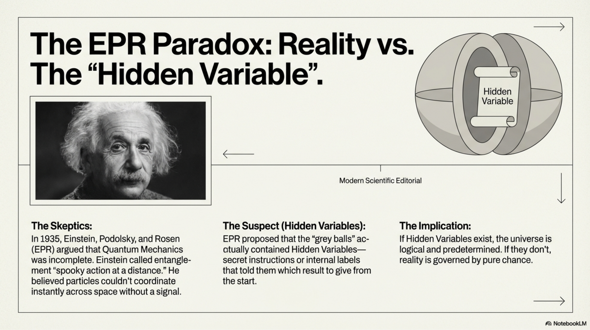
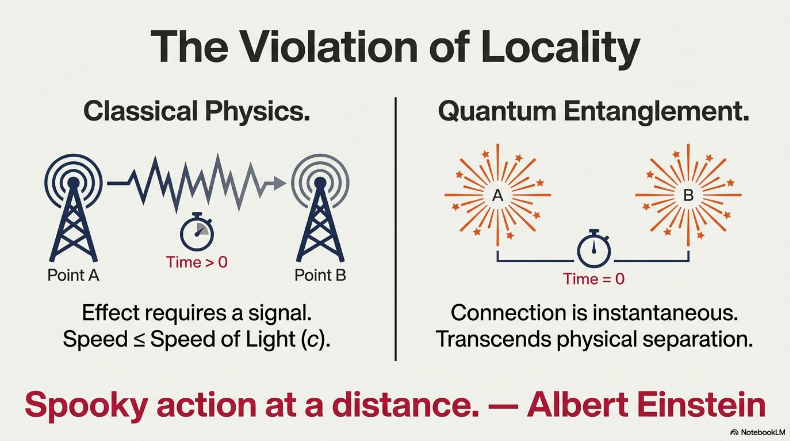
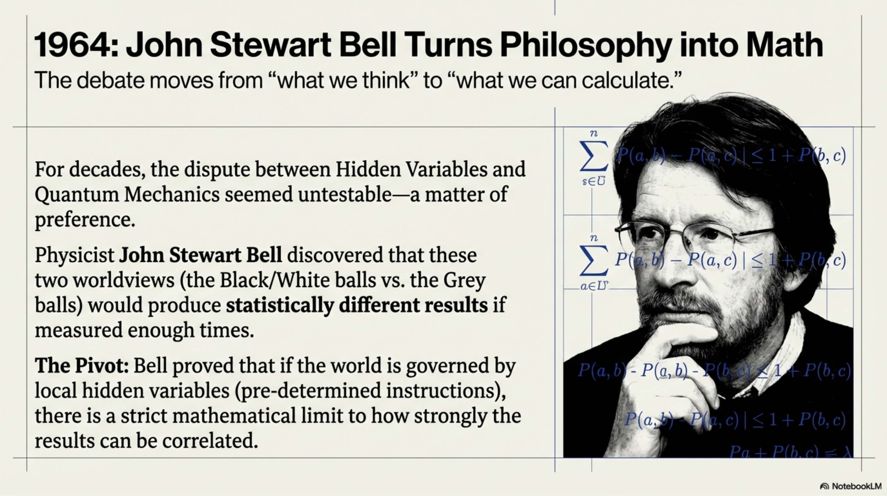
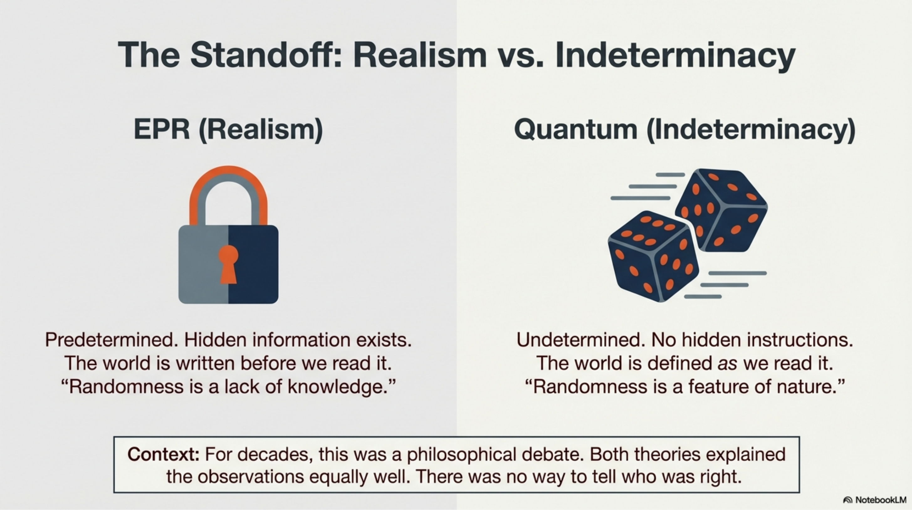
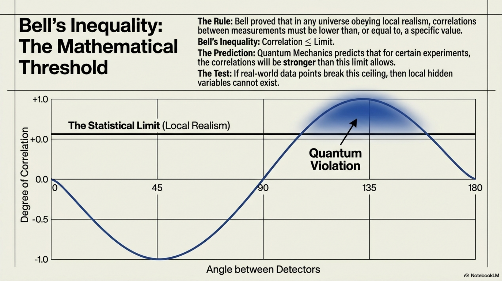
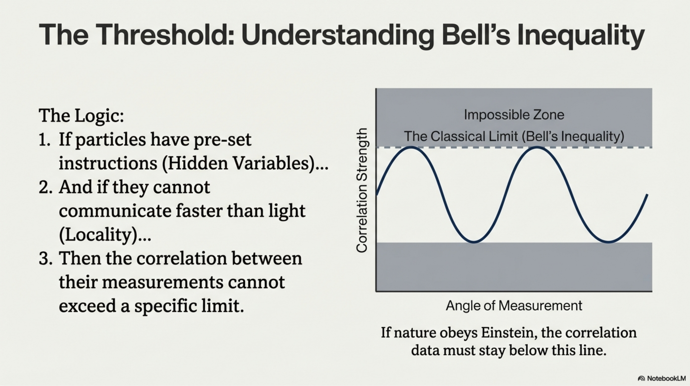
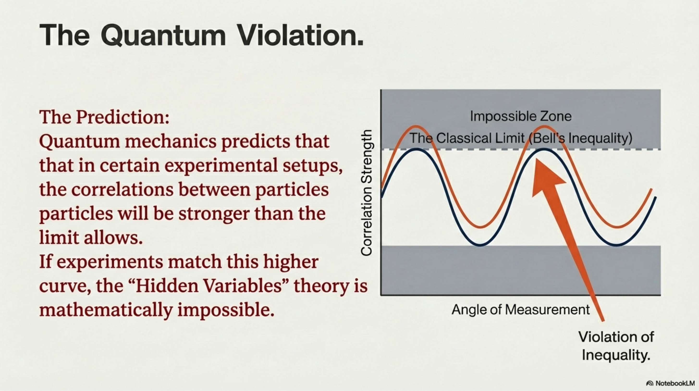
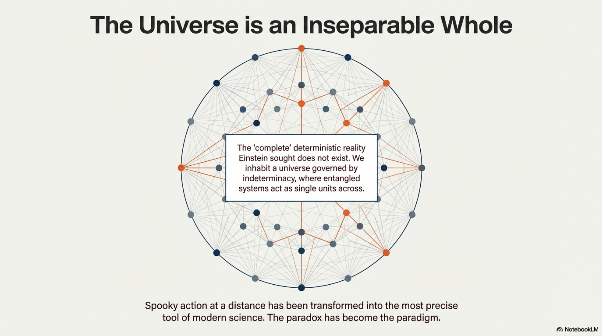

**10.1 EExplaining entanglement: from a paradox to paradigm**

Quantum entanglement describes a state where the quantum properties of a
group of particles are so inextricably linked that the state of an
individual particle cannot be described independently of the others,
regardless of the spatial distance between them. Entanglement is a
fundamental trait of quantum mechanics where two or more particles exist
in a shared state, behaving as a single unit regardless of the distance
between them.

In an entangled system, the state of each particle cannot be described
independently; what happens to one particle immediately determines the
result of a measurement on the other, even if they are far apart. Two
fundamental core concepts define entanglement:

\(1\) Violation of Locality and "Spooky Action".

Entanglement challenges our traditional understanding of cause and
effect because it suggests a connection that transcends physical
separation. In classical physics, an effect requires a signal to travel
between locations, and no signal can travel faster than light.
Entanglement, however, does not require a signal to connect the separate
parts of the system. This led Albert Einstein to call the phenomenon
"spooky action at a distance". He argued that quantum mechanics must be
"incomplete" and that there must be "hidden variables" or secret
instructions within the particles.

\(2\) Fundamental indeterminacy (The "Grey Ball" Analogy).

Unlike classical objects, entangled particles have no determined states
until they are measured. In a classical view, if you send a black ball
one way and a white ball the other, they were always those colors from
the moment they were sent. In quantum entanglement, the balls are "grey"
(undetermined) right until someone looks at one. At that instant, one
randomly takes a value (e.g., "black") and the other immediately becomes
the opposite ("white").

**Einstein-Podolsky-Rosen paradox**

Classical physics signals that an event in one location cannot influence
another distant location faster than the speed of light. According to
this, the Einstein-Podolsky-Rosen (EPR) paper represented a
sophisticated strategic attempt to defend "Local Realism" which
considers that things have definite properties (realism) and that
nothing moves faster than light (locality).

They believed that randomness was an illusion caused by a lack of
knowledge, not a feature of nature and that the uncertainty principle
was not a fundamental limit of nature, but rather a limitation of the
current theory. EPR challenges our understanding of reality by arguing
that quantum mechanics does not provide a complete description of the
world.

EPR critique emerged from the broader context of the Bohr-Einstein
debates, where Einstein expressed profound dissatisfaction with the
probabilistic nature of the new physics. Einstein argued that if one
could predict the value of a physical quantity (such as position or
momentum) without disturbing the system, then that quantity must
correspond to an "element of reality” and have a predetermined
measurable value. Einstein summarized was opposed to the alternative
quantum probabilistic view, which requires a non-local connection
between particles

EPR argued that quantum mechanics was "incomplete" because it seemed to
allow for an influence between distant particles without a physical
signal. To explain entanglement without violating locality, EPR
considered the existence of predetermined secret instructions carried by
particles from the moment they are emitted: the so called "hidden
variables”. The outcome of any experiment is predetermined because the
particles carry a shared script that dictates their behavior from the
start. Therefore, it was "unfeasible" that a measurement on one particle
could immediately determine the state of another far away without a
signal connecting them.

Next two elements define EPR approach to entanglement:

1. Hidden Information: The postulate that quantum mechanics is an
incomplete description, masking a deterministic reality governed by
hidden variables.

The central debate of the EPR paradox is whether particles possess
predetermined properties before they are measured. According to EPR for
a theory to be "complete," every element of physical reality must have a
counterpart in the theory. They suggested that if we can predict a
particle's state without disturbing it, that state must have been
predetermined by "hidden variables" containing internal instructions the
particles carry with them.

Nevertheless, according to Quantum mechanics, particles have no
determined state until the moment of measurement. This is often compared
to "grey balls" that only become black or white when someone looks at
them. Furthermore, experiments have since proven that nature follows
this indeterminate quantum path, meaning the "complete" deterministic
description EPR sought does not exist.

2. Conflict with Locality: The principle of locality indicates that
physical interactions cannot propagate faster than the speed of
light—which entanglement seemingly violates.

EPR paradox highlights a breakdown in the traditional understanding of
cause and effect: according to classical physics an event in one
location cannot influence another distant location faster than the speed
of light. This effect could be produced by a "spooky action" making it
possible that a measurement on one particle could immediately determine
the state of another far away without a signal connecting them.

According to Quantum mechanics an entangled system acts as a single unit
regardless of the distance between its parts. Entangled particles are
treated as a single system where measurement causes an immediate wave
function collapse across spacelike intervals. The state of such a
composite system is expressible as a superposition of products of local
constituent states; it is defined as "entangled" if this sum cannot be
factored into a single product term, rendering the system an inseparable
whole. .

For a long time, it was debated whether entangled particles appeared to
affect each other because they contained hidden variables—internal
instructions that determined their state from the moment they were
created. However, the experimental validation of quantum mechanics
specifically disproves the possibility that particles carry "secret
instructions" or predetermined labels. The results of quantum mechanics
and the theory of hidden variables cannot coexist because they lead to
different mathematical outcomes that have been tested and resolved
through experimentation. The two approaches are mathematically
incompatible.

The "complete" reality envisioned by proponents of hidden
variables—where every property exists exactly where it is measured and
is predetermined by internal instructions—is incompatible with the
experimental evidence of quantum entanglement. In the quantum world
there exist a fundamental indeterminacy: measurement forces reality to
choose a state, collapsing the wave function across the entire system
instantly. This conflict between local realism and quantum indeterminacy
was solved when a philosophical debate about "spooky action at a
distance" was approached as a test to be proved in mathematical terms.
It was proved that nature is fundamentally undetermined until measured.

**Violation of Bell’s Inequality**

In 1964 John Stewart Bell proposed a mathematical inequality to solve
the question of the validity of the theory of hidden variables. He
observed that the EPR dilemma could be formulated in the form of
assumptions, which naturally led to a falsifiable prediction: if there
are hidden variables, the correlation between the results of a large
number of measurements will never exceed a certain value. This result,
nowadays referred to as Bell´s inequality, proved that if hidden
variables existed, the correlation between the results of a large number
of experimental measurements would never exceed a specific value.

Bell proved that if particles carry "hidden variables" (internal
instructions telling them which result to give), the correlation between
measurement results will never exceed a specific mathematical value.
However, quantum mechanics predicts stronger correlations that violate
this inequality, a prediction that has been confirmed by multiple
experiments. Therefore, the "complete" reality envisioned by
Einstein—one where every property is fixed and independent of
observation—is incompatible with the experimental evidence of quantum
entanglement.

Bell’s inequality is a mathematical formula developed by John Stewart
Bell in 1964 to determine whether the universe operates according to
classical "hidden variables" or the rules of quantum mechanics. It
serves as a mathematical threshold that shifted the debate over quantum
entanglement from a philosophical disagreement into a testable reality.
Bell proved that in any theory obeying local realism, the correlation
between the results of a large number of measurements would always be
lower than, or at most equal to, a specific value. This constraint is
known as Bell’s inequality, which can be described in terms of two key
concepts:

1\. The Statistical Limit of Correlation

The core of Bell’s inequality is a mathematical limit on how strongly
the results of measurements on two distant particles can be correlated.
If the world was governed by local hidden variables there was a specific
mathematical limit to the strength of the correlations between
measurement results. Bell proved that if particles carry "hidden
variables" the correlation between measurement results must always be
lower than, or at most equal to, a specific value. This mathematical
constraint represents the boundary of what is possible in a world
governed by local realism: the classical idea that no influence travels
faster than light and that objects have definite properties before they
are observed.

2\. The Quantum Violation

Bell showed that quantum mechanics predicts stronger correlations for
certain experiments that would violate this inequality, exceeding the
mathematical limit possible for hidden variables. If an experiment
results in a correlation that exceeds Bell's specific value, it is said
to violate the inequality. Any such violation proves that the particles
are not following pre-set instructions (like the "black and white balls"
analogy where colors are fixed from the start) but are instead behaving
as "grey balls" with no determined state until the moment of
measurement.

3\. Experimental Proof

This mathematical test allowed researchers to physically determine which
description of reality was correct. John Clauser conducted the first
practical tests using entangled photons, which resulted in a clear
violation of Bell’s inequality, aligning with quantum mechanics.
Afterwards, Alain Aspect and Anton Zeilinger refined these tests to
close loopholes, using methods such as signals from distant galaxies to
ensure measurement settings were truly independent.

The consistent violation of Bell's inequalities in experiments proved
that the "spooky" correlations of entanglement are not caused by hidden
instructions but are a fundamental property of an indeterminate nature,
where particles act as a single, inseparable unit regardless of the
distance between them. If the world worked the way EPR suggested (with
hidden variables and local reality), the correlation between particle
measurements would never exceed certain limit.

Bell’s theorem moved the debate into the realm of quantitative science
by demonstrating that no physical theory of local hidden variables could
ever reproduce all the predictions of quantum mechanics. He realized the
EPR dilemma wasn´t just philosophy; it could be formulated as a
falsifiable prediction: there is a strict mathematical limit that any
theory based on local realism must obey. Bell concluded: "If a
hidden-variable theory is local it will not agree with quantum
mechanics, and if it agrees with quantum mechanics it will not be
local." Bell’s inequality proved that nature is fundamentally
indeterminate by providing a mathematical way to distinguish between
quantum mechanics and a reality governed by "hidden variables" or secret
instructions.

Before Bell’s work, a major question was whether the correlation between
entangled particles existed because they contained predetermined
instructions that told them which result to give. He discovered that if
a theory relies on hidden variables, the correlation between the results
of a large number of measurements must stay below or equal to a specific
value. Quantum mechanics, however, predicts that certain experiments
will violate Bell’s inequality. It suggests that the particles have no
determined states until they are measured. This predicts a stronger
correlation than would be possible if the results were governed by
hidden variables.

Next Table 10.2 shows the main differences between the previously
considered approaches to entanglement.

<table style="width:100%;">
<colgroup>
<col style="width: 22%" />
<col style="width: 28%" />
<col style="width: 28%" />
<col style="width: 19%" />
</colgroup>
<thead>
<tr>
<th colspan="4" style="text-align: center;">Table 10.2. Comparison of
Realist and Quantum Mechanics.</th>
</tr>
</thead>
<tbody>
<tr>
<td style="text-align: center;">Criterion</td>
<td>Local Hidden-Variable Theories (Realism)</td>
<td style="text-align: center;">Quantum Mechanical Predictions</td>
<td style="text-align: center;">Experimental Evidence</td>
</tr>
<tr>
<td style="text-align: center;">Predetermination</td>
<td>Results are fixed at emission.</td>
<td style="text-align: center;">States are undetermined until
measurement.</td>
<td style="text-align: center;">Violations confirm indeterminacy.</td>
</tr>
<tr>
<td style="text-align: center;">Locality</td>
<td>Interactions are limited by speed.</td>
<td style="text-align: center;">Systems act as a single unit
transcending separation.</td>
<td style="text-align: center;">Spacelike correlations observed.</td>
</tr>
<tr>
<td style="text-align: center;">Mathematical Limit</td>
<td>Statistical correlations must obey Bell’s Inequality.</td>
<td style="text-align: center;">Correlations can exceed and violate
Bell´s Inequality.</td>
<td style="text-align: center;">Bell's Inequality consistently
violated.</td>
</tr>
</tbody>
</table>

The debate between local realism and quantum indeterminacy was seen as a
matter of interpretation rather than empirical testing. Critical
experiments have since proven that nature follows indeterminate quantum
paths, meaning the "complete" deterministic description EPR sought does
not exist. This fact has shifted the scientific paradigm from a local
realist worldview to a fundamentally quantum mechanical understanding of
reality. Ultimately, the "spooky action at a distance", that once served
as a critique of quantum mechanics, has been transformed into the most
precise and powerful tool of modern information science, signaling the
dawn of the paradigm of entanglement as a resource.

